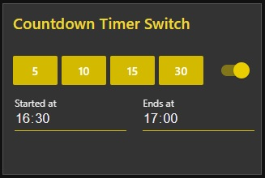

# node-red-contrib-ui-countdown-timer-switch
A node-red-ui countdown timer switch for the Node-RED Dashboard.  

## Install
  
You can install this node directly from the "Manage Palette" menu in the Node-RED interface.  
Alternatively, run the following command in your Node-RED user directory - typically `~/.node-red` on Linux or `%HOMEPATH%\.nodered` on Windows

        npm install node-red-contrib-ui-countdown-timer-switch

### Requirements ###
node-red v0.19 or above  
node-red-dashboard v2.10.0 (v2.15.4 or above would be ideal)

## Usage
  
Add a countdown-timer-switch-node to your flow. Open the dashboard, by default you will see four buttons.
Each button has a label with a number that indicates how long the switch stays on (in minutes). Click one of
those buttons and the switch will be on for the specific amount of time.

## History
  
Find the changelog [here](CHANGELOG.md).
  
# Donate
  
You can donate by clicking the following link if you want to support this free project:
  

