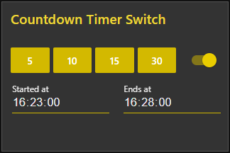

# node-red-contrib-ui-countdown-timer-switch
A node-red-ui countdown timer switch for the Node-RED Dashboard.  

## Install
  
You can install this node directly from the "Manage Palette" menu in the Node-RED interface.  
Alternatively, run the following command in your Node-RED user directory - typically `~/.node-red` on Linux or `%HOMEPATH%\.nodered` on Windows

        npm install node-red-contrib-ui-countdown-timer-switch

### Requirements ###
node-red v0.19 or above  
node-red-dashboard v2.10.0 (v2.15.4 or above would be ideal)

## Usage
  
Add a countdown-timer-switch-node to your flow. Open the dashboard, by default you will see four buttons.
Each button has a label with a number that indicates how long the switch stays on (in minutes). Click one of
those buttons and the switch will be on for the specific amount of time.

### Input

The countdown can be activated via an incoming message if it has a property countdown.
The value of msg.countdown must be a number in minutes. The switch will stay on for
the specified amount of time. A msg.countdown with a value of 0 turns the switch off.

The status of the switch can be queried by sending a message with `msg.topic` equal to
"status". `msg.state` can be set to specify the name of the property holding the switch
state in the output. It will default to "state" if not provided. `msg.payload` will
be passed through to the output.

**Note:** You can provide a countdown message _or_ a status request in a single
message, not both.

### Output

This node has 3 outputs: switch position, on branch and off branch.

#### Switch position

This output provides a message when the state of the switch changes. `msg.payload` 
contains the state of the switch.

#### On Branch

This output is triggered when the status is requested on the input and the switch 
is on.

#### Off Branch

This output is triggered when the status is requested on the input and the switch 
is off.

## History
  
Find the changelog [here](CHANGELOG.md).
  
# Donate
  
You can donate by clicking the following link if you want to support this free project:
  

